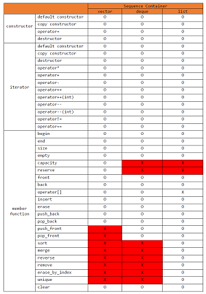

# STL
 File structure
--------------------------------------
* Sequence
	+ vector
	+ list
	+ deque
* Adaptive
	+ stack
	+ queue
	+ pri_queue
* Associative
	+ set
	+ map
	

Sequence Containers
--------------------------------------
A sequence container is a container that stores objects of the same type in a linear arrangement. These are the functions supported by the Sequence containers in this library.

 </img>

Adapter Containers
--------------------------------------
Adaptor Containers(Container adpators) provide a different interface for sequential containers. 

Associative Containers
--------------------------------------
Associative containers access an element using a key. They implement sorted data structures that can be queickly serached (O(log n) complexity).

 

 

 

 

 

 

 

 

 

 

 

 

 

 

 

 

 

 

 

 

 

 

 

 

 

 

 

 

 
